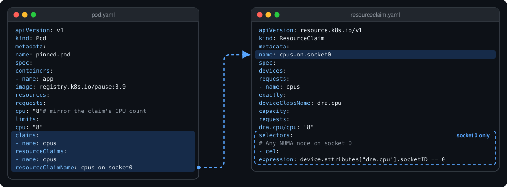
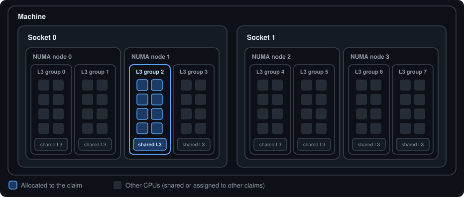
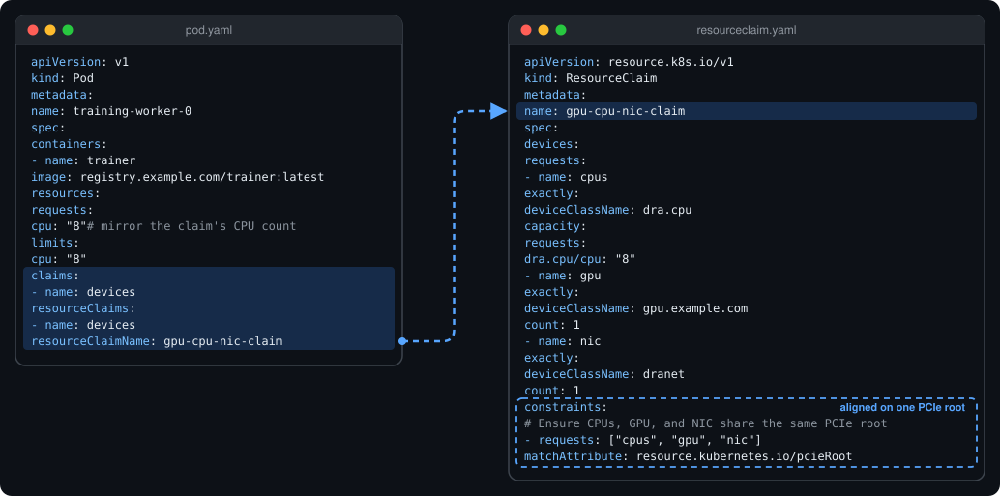
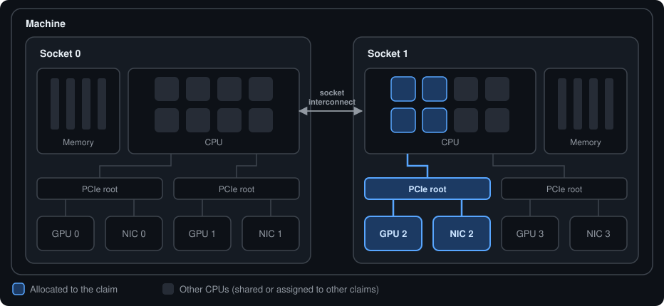
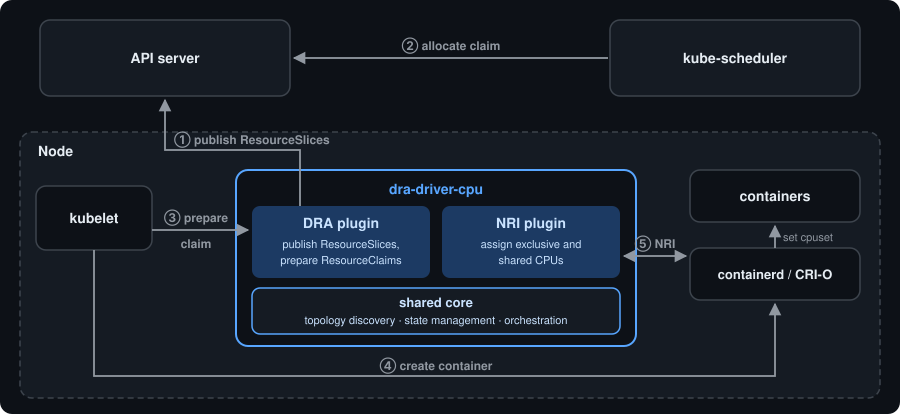

# dra-driver-cpu

dra-driver-cpu is a Kubernetes Dynamic Resource Allocation (DRA) driver that assigns exclusive CPUs
to workloads through `ResourceClaims`.
This driver provides an alternative to the [CPUManager](https://kubernetes.io/docs/tasks/administer-cluster/cpu-management-policies/) functionality implemented in the kubelet, offering additional benefits such as advanced topology selection through the rich DRA API and alignment with other DRA-managed resources (like GPUs and high-speed NICs).

## Getting Started

The recommended way to install the driver is via the provided Helm chart:

```bash
helm install dra-driver-cpu oci://registry.k8s.io/dra-driver-cpu/charts/dra-driver-cpu -n kube-system
```

> [!IMPORTANT]
>
> - Your cluster's container runtime must support NRI and CDI — see [Compatibility](docs/user/installation.md#compatibility).
> - The kubelet's CPUManager and this DRA driver are mutually incompatible, and only one can be enabled at a time on any
>   given node — see [Configuration](docs/user/configuration.md) for how to disable the CPUManager.

The [Quickstart](docs/user/quickstart.md) walks through installing the driver and running a pod on exclusive CPUs, with a verification step after each stage. See the [Helm chart README](deployment/helm/dra-driver-cpu/README.md) for the full list of configuration options, and
[Installation](docs/user/installation.md) for compatibility, upgrade, and uninstall details.

## Key Features

- **Topology-Aware CPU Discovery:** Discovers the node's full CPU topology by reading sysfs, including sockets, NUMA nodes, cores, SMT siblings, Last-Level Cache (LLC), core types (Performance/Efficiency), and optionally PCIe root locality.
- **Exclusive CPU Allocation:** Pods requesting CPUs via a `ResourceClaim` are pinned to exclusive, guaranteed CPUs enforced through CDI and NRI.
- **Shared Pool Management:** All other containers are dynamically confined to a shared pool made up of CPUs not exclusively assigned to any guaranteed container.
- **Grouped Device Exposure:** `grouped` mode exposes NUMA node, socket, or machine aggregates as consumable capacity. The driver also implements an `individual` mode which is now **deprecated**; see [Migrating from individual mode](docs/user/opaque-cpuset-overrides.md#migrate-from-individual-mode).
- **CPU Manager Feature Parity:** Aims to match key kubelet CPUManager static policy options (e.g. `PreferAlignByUnCoreCache`, `StrictCPUReservation`) - see [Feature Support](docs/user/feature-support.md) for the full comparison.
- **Stateful Restarts:** Synchronizes with existing pods on restart by inspecting CDI-injected environment variables, rebuilding its allocation state without disrupting running workloads.

## Use Cases

### Topology-aware CPU allocation per workload

Each workload requests its own exclusive CPUs through a `ResourceClaim`. A CEL selector
constrains where the CPUs come from — for example, a specific NUMA node or socket — and the
selection can be made per workload.

**Example:** a claim to request CPUs on socket 0.



**Allocation:**



The CEL selector only picks socket 0; the driver keeps the allocation as tight as possible, within
a single NUMA node and packed into as few L3 caches as the free CPUs allow. To also pin to a specific NUMA
node, a second selector on `resource.kubernetes.io/numaNode` can be used alongside the socket one.

To keep scheduler accounting correct, either:

- enable the driver's `publishNodeAllocatableResourceMapping` option (Kubernetes 1.37+ with the
  `DRANodeAllocatableResources` feature gate), or
- mirror the claim's CPU count in the container's `cpu` requests and limits, as shown above.

See [Workload Configuration Requirements](docs/user/workload-requirements.md) for details.

### CPU alignment with other DRA-managed resources

CPUs are allocated through the same DRA machinery as GPUs (e.g. the
[NVIDIA GPU DRA driver](https://github.com/kubernetes-sigs/dra-driver-nvidia-gpu)) and NICs
(e.g. [DraNet](https://github.com/kubernetes-sigs/dranet)), so one claim can keep them on the same
NUMA node or PCIe root. This helps avoid the extra latency and bandwidth contention of
cross-socket traffic:

**Example:** one claim for CPUs, a GPU and a NIC that must share a PCIe root.



**Allocation:**



- PCIe root attributes are opt-in — see [Exposing PCIe roots](docs/user/feature-support.md#exposing-pcie-roots).
- For all selectable attributes and more example claims, see [Device Attributes and Selectors](docs/user/device-attributes.md).
- Coming from the kubelet CPU Manager? See the [option-by-option mapping](docs/user/feature-support.md#matching-cpu-manager-options).

## How It Works

The driver runs as a single executable, deployed as a DaemonSet on every node.



See [How it Works](docs/user/how-it-works.md) for the detailed architecture.

## Troubleshooting

If you run into problems, run the [`dracpu gatherinfo`](docs/user/troubleshooting.md) diagnostic tool and attach its output
when filing an issue — it collects the CPU topology and driver configuration needed to diagnose most problems quickly.

## Documentation

### User Documentation

- [Quickstart](docs/user/quickstart.md) - install, run a pod on exclusive CPUs, and verify each step.
- [Installation](docs/user/installation.md) - compatibility, runtime setup, security, uninstall, and migration from `install.yaml`.
- [Upgrade](docs/user/upgrade.md) - release-specific upgrade actions. Read this before upgrading the driver!
- [Configuration](docs/user/configuration.md) - the config file schema, command-line flags, and kubelet prerequisites.
- [How it Works](docs/user/how-it-works.md) - driver architecture, CDI, and NRI integration.
- [Feature Support](docs/user/feature-support.md) - supported/unsupported features.
- [Matching Kubelet CPU Manager Options](docs/user/feature-support.md#matching-cpu-manager-options) - kubelet cpumanager policy options and their driver equivalents.
- [Workload Configuration Requirements](docs/user/workload-requirements.md) - how to set pod/container CPU requests alongside DRA claims.
- [Custom Opaque CPUSet Allocation Overrides](docs/user/opaque-cpuset-overrides.md) - implement explicit core assignment when the external allocator integration is enabled; recommended upgrade path for users of `individual` mode.
- [Metrics](docs/user/metrics.md) - Prometheus metrics exposed by the driver.
- [Device Attributes and Selectors](docs/user/device-attributes.md) - selectable device attributes, CEL selector examples, and sample `ResourceSlice` output in each mode.
- [Troubleshooting & Diagnostics](docs/user/troubleshooting.md) - the `dracpu gatherinfo` diagnostic tool.

### Developer Documentation

- [Testing](docs/dev/testing.md) - running unit/E2E tests and testing local changes in a Kind cluster.
- [Linting](docs/dev/linting.md) - running and auto-fixing lint issues.
- [Logging Guidelines](docs/dev/logging.md)
- [Configuration Guidelines](docs/dev/configuration.md) - about adding more tunables to the driver
- [Deep dive: PCI/PCIe root buses on Linux](docs/dev/pci-bus-linux-sysfs.md)
- [Deep dive: Linux topology reporting](docs/dev/topology-linux-sysfs.md)

## Community, discussion, contribution, and support

Learn how to engage with the Kubernetes community on the [community page](http://kubernetes.io/community/).
Participation in the Kubernetes community is governed by the [Kubernetes Code of Conduct](code-of-conduct.md).

You can reach the maintainers of this project at:

- [Slack](https://slack.k8s.io/) - preferred channels: #sig-node #wg-device-management
- [Mailing List](https://groups.google.com/a/kubernetes.io/g/dev)
