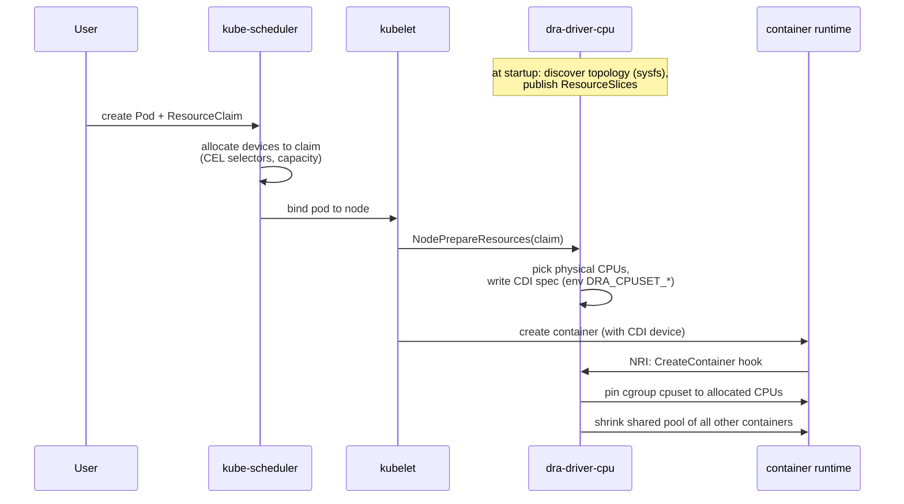

# How it Works

The driver is deployed as a DaemonSet running a single executable which implements two core components. The lifecycle of a claim, from pod creation to a pinned container:

The two components in detail:

- **DRA driver**: This component is the main control loop and handles the interaction with the Kubernetes API server for Dynamic Resource Allocation.

  - **Topology Discovery**: It discovers the node's CPU topology, including details like sockets, NUMA nodes, cores, SMT siblings, Last-Level Cache (LLC), and core types (e.g., Performance-cores, Efficiency-cores). This is done by reading sysfs files.
  - **ResourceSlice Publication**: Based on the `--cpu-device-mode` flag, it publishes `ResourceSlice` objects to the API server:
    - In `individual` mode, each allocatable CPU becomes a device in the `ResourceSlice`, with attributes detailing its topology.
    - In `grouped` mode, devices represent larger CPU aggregates (like NUMA nodes or sockets). These devices support consumable capacity, indicating the number of available CPUs within that group.
  - **Claim Allocation**: When a `ResourceClaim` is assigned to the node, the DRA driver handles the allocation:
    - In `individual` mode, the scheduler has already selected specific CPU devices. The driver enforces this selection through CDI and NRI.
    - In `grouped` mode, the claim requests a *quantity* of CPUs from the group device. The driver then uses topology-aware allocation logic (imported from [Kubelet's CPU Manager](https://github.com/kubernetes/kubernetes/blob/v1.35.0/pkg/kubelet/cm/cpumanager/cpu_assignment.go)) to select the physical CPUs within the group. Strict compatibility with kubelet's cpumanager or CPU allocation is not a goal of this driver. This decision will be reviewed in the future releases.
  - **CDI Spec Generation**: Upon successful allocation, the driver generates a CDI (Container Device Interface) specification.

- **CDI (Container Device Interface)**: The driver uses CDI to communicate the allocated CPU set to the container runtime.

  - A CDI JSON spec file is created or updated for the allocated claim.
  - This spec instructs the runtime to inject an environment variable (e.g., `DRA_CPUSET_<claimUID>=<cpuset>`) into the container.
  - The `DRA_CPUSET_*` environment variable prefix is reserved for the driver. Containers with malformed `DRA_CPUSET_*` values are rejected during creation.
  - The driver includes mechanisms for thread-safe and atomic updates to the CDI spec files.

- **NRI Plugin**: This component integrates with the container runtime via the Node Resource Interface (NRI).

  - For containers with **guaranteed CPUs** (those with a DRA ResourceClaim), the plugin reads the environment variable injected via CDI and pins the container to its exclusive CPU set using the cgroup cpuset controller.
  - For all other containers, it confines them to a **shared pool** of CPUs, which consists of all allocatable CPUs not exclusively assigned to any guaranteed container.
  - It dynamically updates the shared pool cpuset for all shared containers whenever guaranteed allocations change (containers are created or removed).
  - On restart, the NRI plugin can synchronize its state by inspecting existing containers and their environment variables to rebuild the current CPU allocations.
